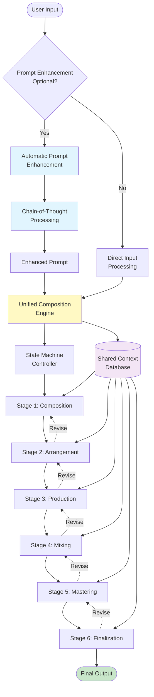
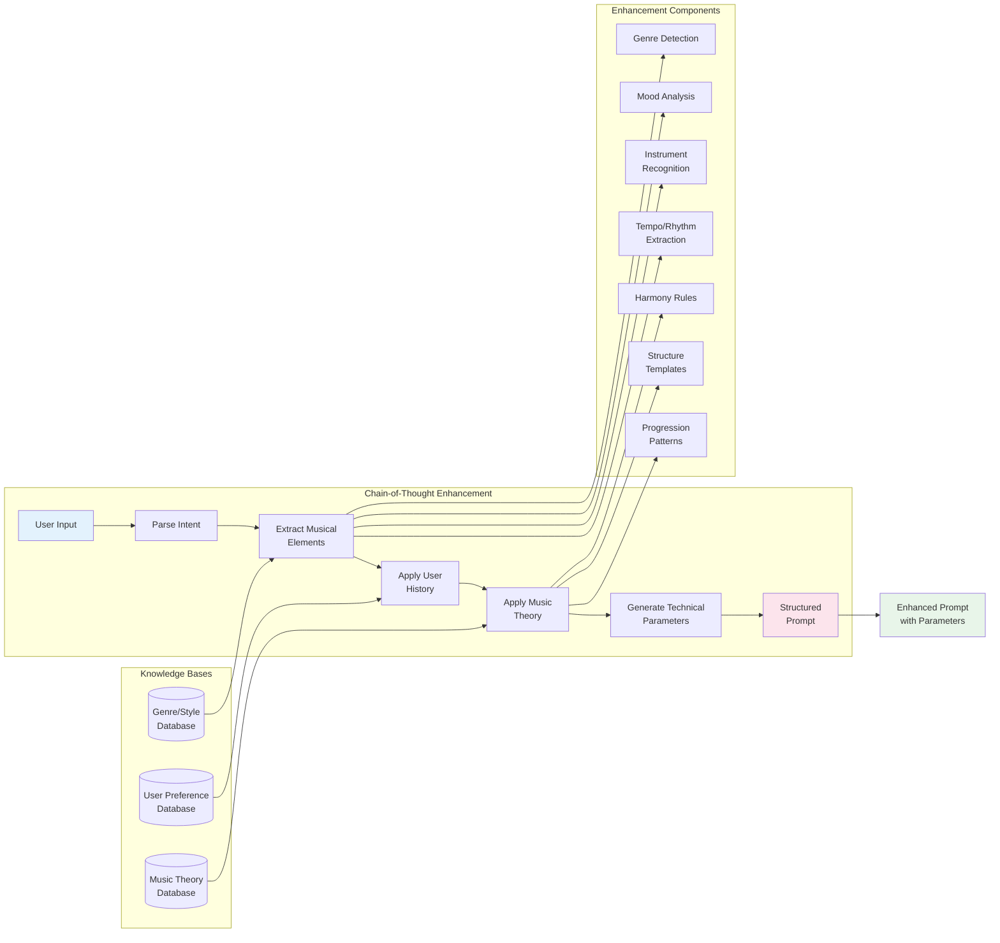
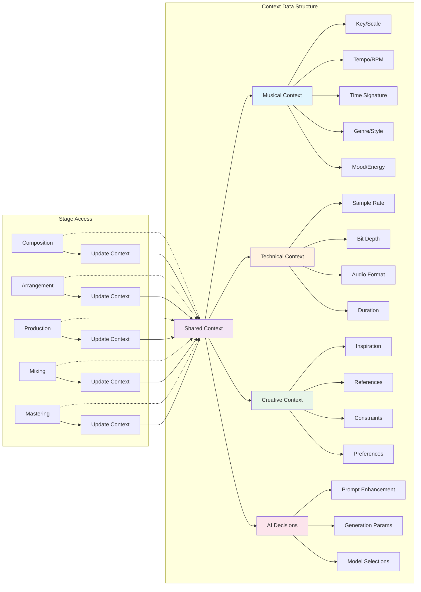
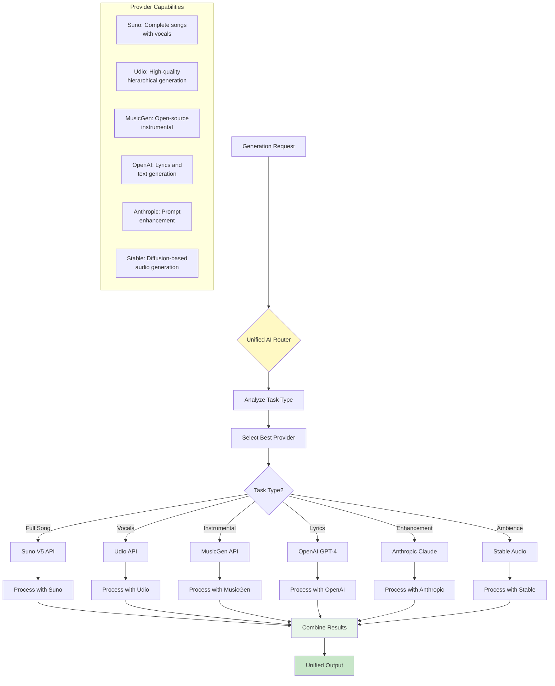
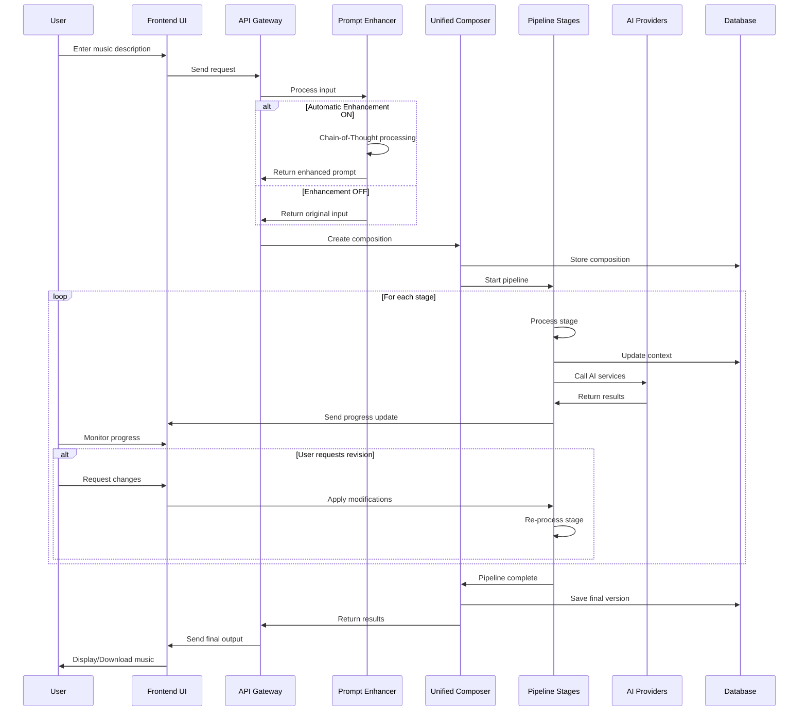
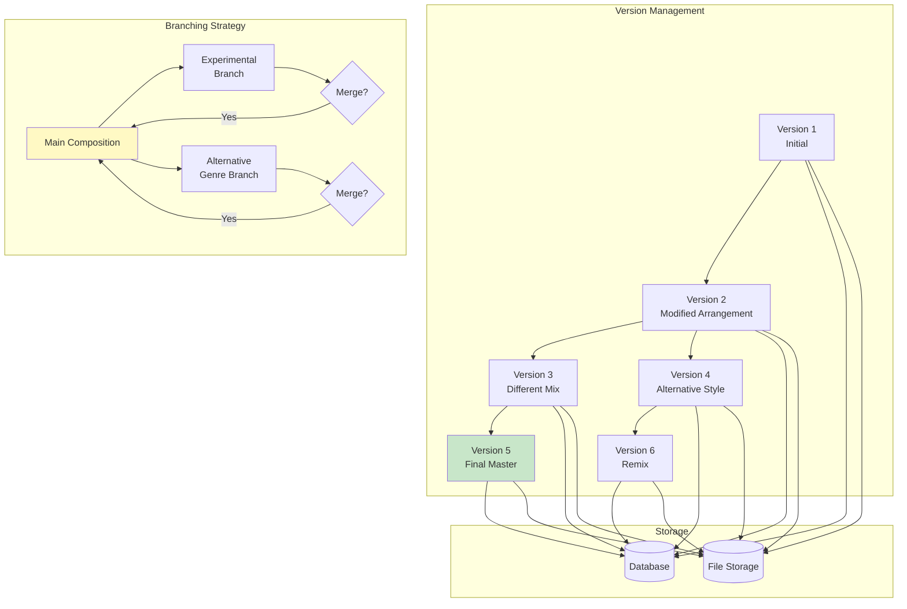
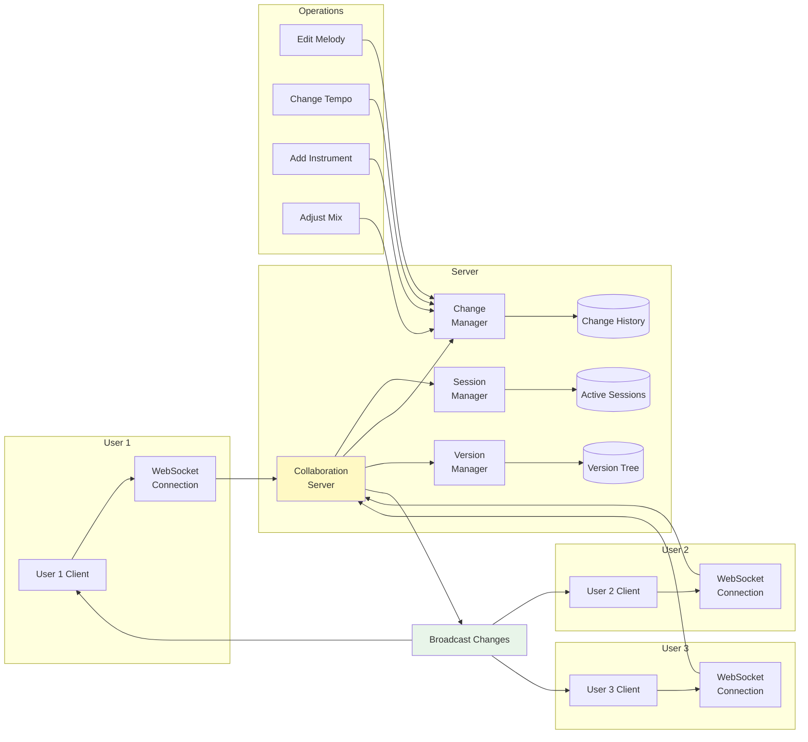
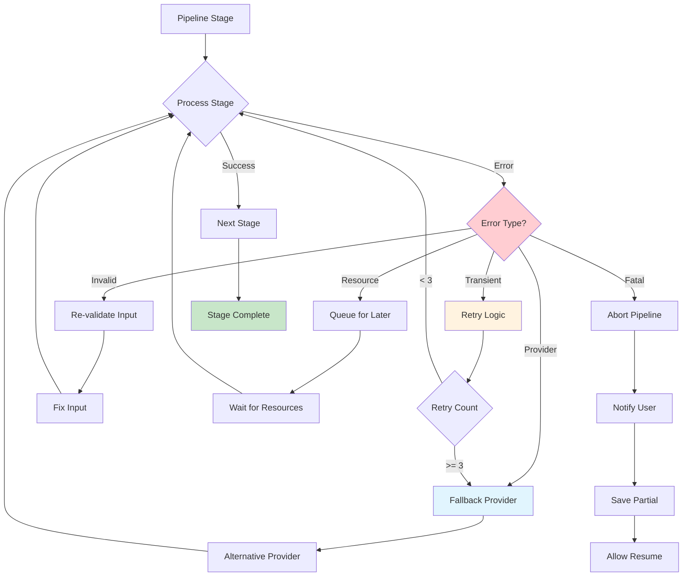
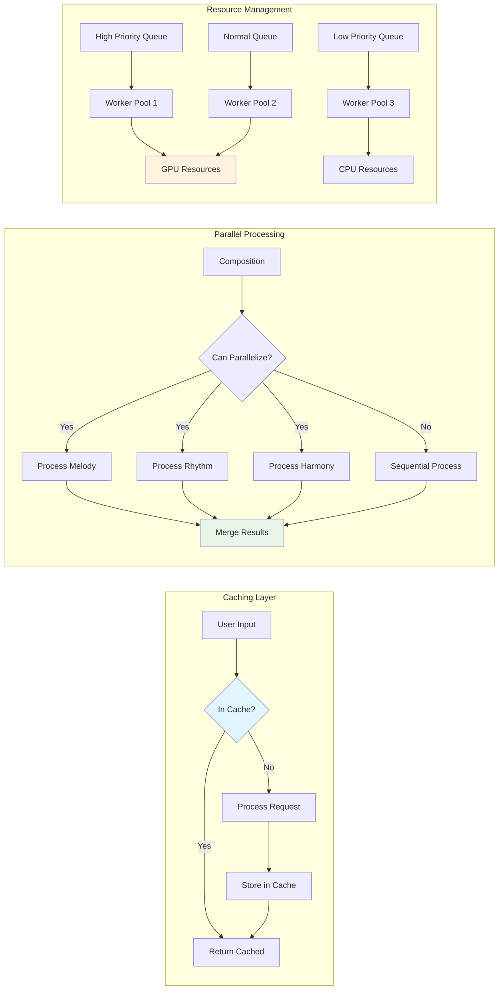

# Music Generation Flow Diagrams
## Visual Documentation of the Unified Architecture

### 1. Main System Flow

### 2. Automatic Prompt Enhancement Flow

### 3. Production Pipeline Stage Flow

```mermaid
graph TD
    subgraph "Stage 1: Composition"
        C1[Receive Enhanced<br/>Prompt] --> C2[Generate Chord<br/>Progression]
        C2 --> C3[Create Melody]
        C3 --> C4[Develop Bass Line]
        C4 --> C5[Design Rhythm<br/>Pattern]
        C5 --> C6[Add Harmonies]
    end

    subgraph "Stage 2: Arrangement"
        A1[Load Composition<br/>Elements] --> A2[Define Song<br/>Structure]
        A2 --> A3[Create Sections<br/>Intro/Verse/Chorus]
        A3 --> A4[Design Transitions]
        A4 --> A5[Plan Dynamics]
        A5 --> A6[Setup Automation]
    end

    subgraph "Stage 3: Production"
        P1[Load Arrangement] --> P2[Select Instruments]
        P2 --> P3[Apply Sound<br/>Design]
        P3 --> P4[Add Effects]
        P4 --> P5[Create Layers]
        P5 --> P6[Add Textures]
    end

    subgraph "Stage 4: Mixing"
        M1[Load Production] --> M2[Balance Levels]
        M2 --> M3[Apply EQ]
        M3 --> M4[Add Compression]
        M4 --> M5[Position in<br/>Stereo Field]
        M5 --> M6[Add Reverb/<br/>Space]
    end

    subgraph "Stage 5: Mastering"
        MA1[Load Mix] --> MA2[Master EQ]
        MA2 --> MA3[Master<br/>Compression]
        MA3 --> MA4[Limiting]
        MA4 --> MA5[Loudness<br/>Optimization]
        MA5 --> MA6[Stereo<br/>Enhancement]
    end

    C6 --> A1
    A6 --> P1
    P6 --> M1
    M6 --> MA1
    MA6 --> Final([Final Master])

    style C1 fill:#e1f5fe
    style A1 fill:#fff3e0
    style P1 fill:#f3e5f5
    style M1 fill:#e8f5e9
    style MA1 fill:#fce4ec
    style Final fill:#c8e6c9
```

### 4. Context Propagation Flow

### 5. AI Provider Routing Flow

### 6. User Interaction Flow

### 7. Version Control Flow

### 8. Real-time Collaboration Flow

### 9. Error Handling and Recovery Flow

### 10. Performance Optimization Flow

## Legend

- **Blue boxes**: Input/Processing stages
- **Yellow boxes**: Core system components
- **Green boxes**: Output/Success states
- **Purple boxes**: Context/Storage
- **Pink boxes**: AI/Enhancement features
- **Orange boxes**: Intermediate processing
- **Red boxes**: Error states
- **Dotted lines**: Optional/feedback paths
- **Solid lines**: Required flow paths

## Notes

1. All diagrams use Mermaid syntax for easy rendering in documentation
2. Flows are designed to be modular and interchangeable
3. Each stage maintains its own error handling
4. Context is preserved throughout the entire pipeline
5. User can intervene at any stage for modifications
6. System supports both synchronous and asynchronous processing
7. All operations are logged for debugging and analytics
8. Performance metrics are collected at each stage